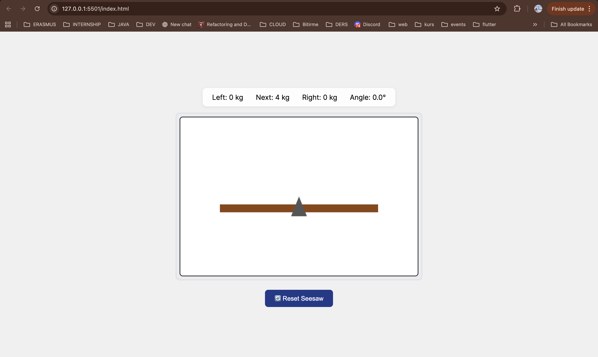
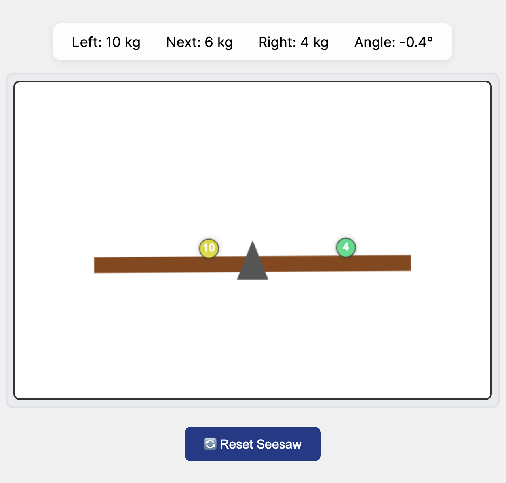
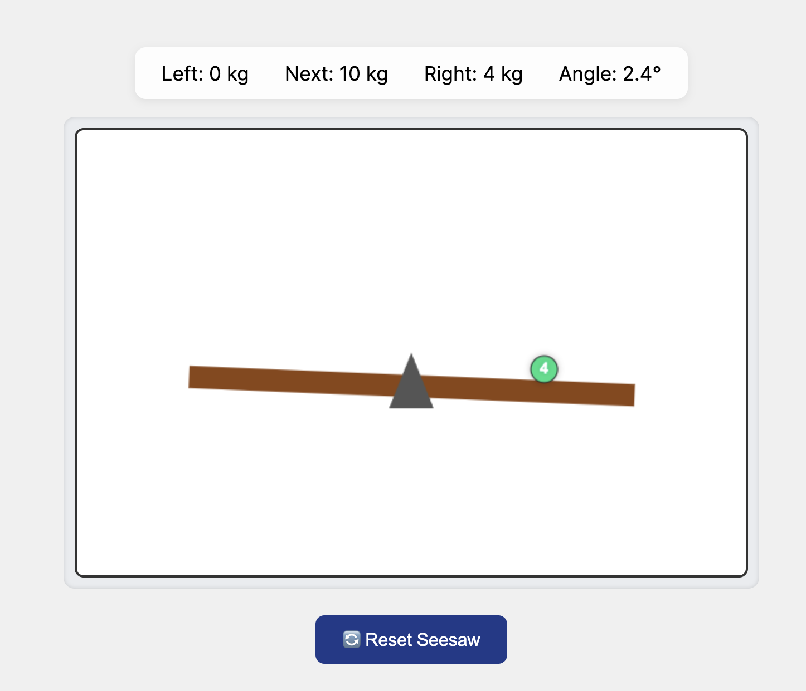
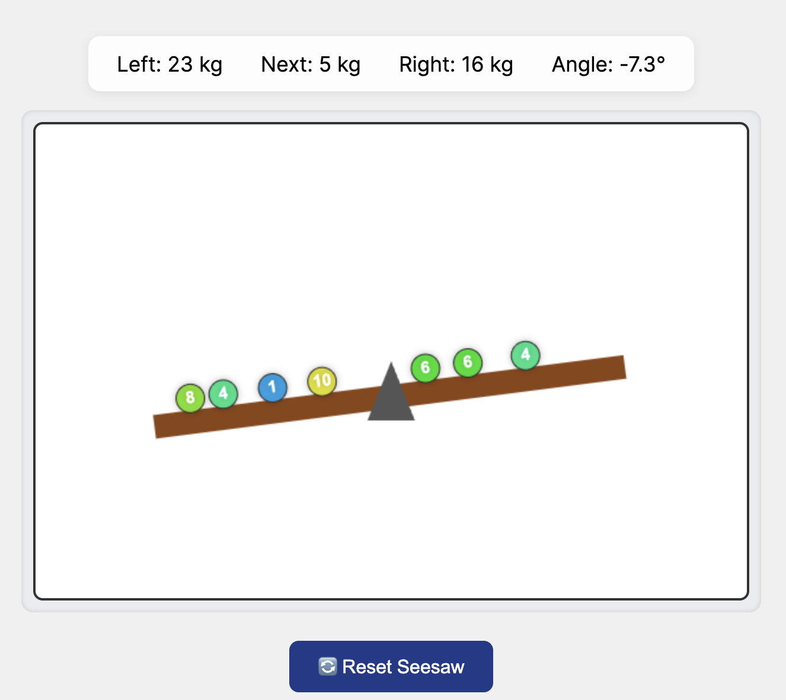
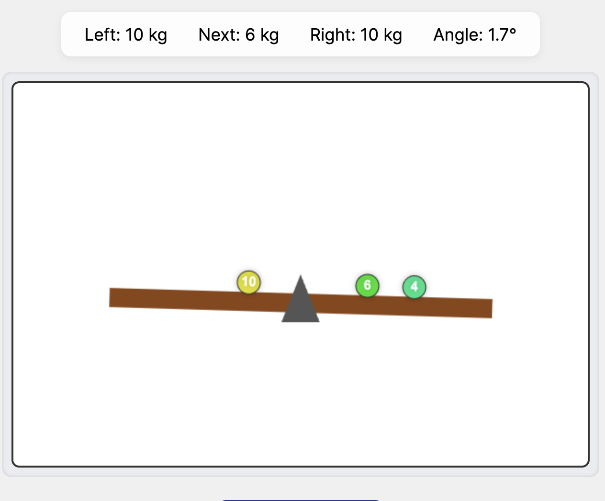
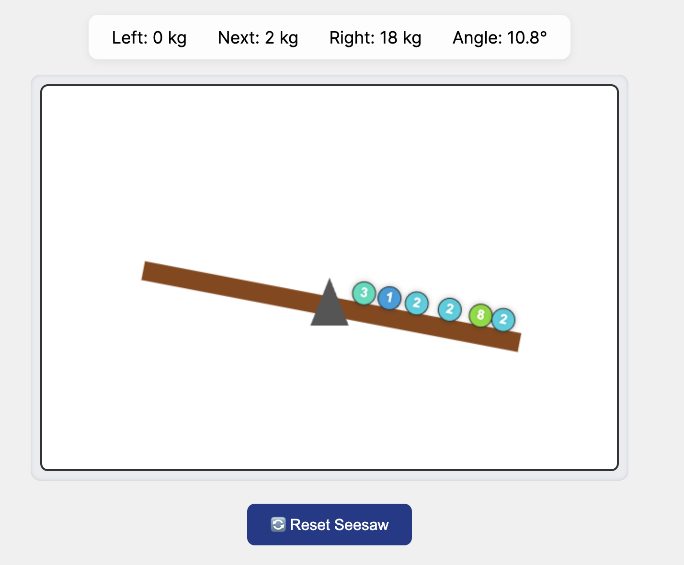
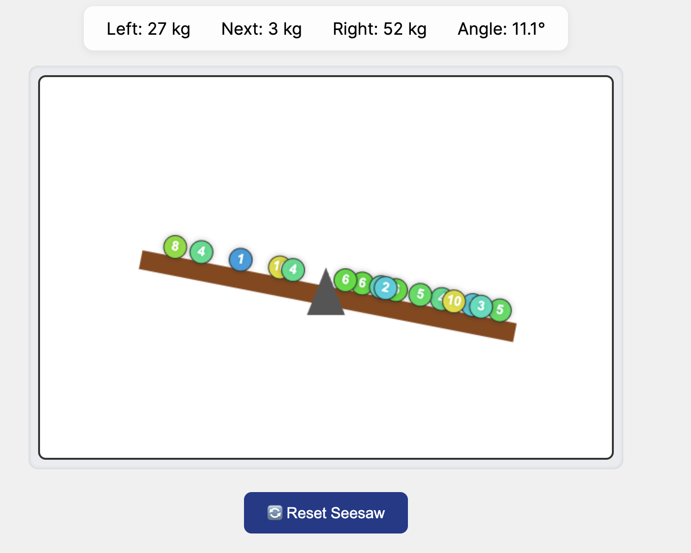

# Seesaw Simulation (Pure JavaScript)

**Main Interface**



**HUD Close-up**




**Seesaw Tilt Example**



**Click Interaction**







**Reset Action**


**Weight Color Variation**


Interactive, physics-driven seesaw built with HTML, CSS, and vanilla JavaScript.
Click anywhere on the plank to drop objects with random weights (1–10 kg).
The seesaw tilts smoothly using real torque logic — just like in real life.

Live Demo (GitHub Pages): https://zgokceaynaci.github.io/seesaw-simulation/ 


---

## Table of Contents

- [Goal & Scenario](#goal--scenario)
- [Features](#features)
- [How It Works (Physics)](#how-it-works-physics)
- [User Interaction & UI](#user-interaction--ui)
- [Persistence](#persistence)
- [Project Structure](#project-structure)
- [Run Locally](#run-locally)
- [Development Process & Commits](#development-process--commits)
- [Design Decisions](#design-decisions)
- [Trade-offs & Limitations](#trade-offs--limitations)
- [Challenges Faced](#challenges-faced)
- [AI Assistance Disclosure](#ai-assistance-disclosure)
- [License](#license)
- [Project Status](#project-status)

---

## Goal & Scenario

**Goal**  
Create a visual seesaw simulation in pure JavaScript where random-weight objects (1–10 kg) are dropped by clicking directly on the **seesaw plank**, and the seesaw tilts based on real physics. The task combines user interaction, logical simulation, animation, and clean JS structure.  
Preview reference: https://seesaw.samet-sevindi.workers.dev/

**Scenario**  
A playground seesaw: a plank balanced on a center pivot. Users click anywhere on the plank to drop objects. Each object’s weight is random (1–10 kg). The seesaw rebalances smoothly based on **all** placed objects.

---
## Features

- **Pure JS/HTML/CSS** — no frameworks or libraries.
- **Clean, minimal UI** (HUD + Reset button).
- **Accurate placement:** objects appear **exactly where you click** on the plank.
- **Real-time torque calculation:**
  - Per-side torque: `Σ(weight × distanceFromPivot)`
  - Angle proportional to torque difference, **clamped to ±30°**
- **Random weight generation (1–10 kg).**
- **Sound feedback** when objects drop.
- **Reset** button to clear the scene quickly.
- **Lightweight and responsive.**
- **(In progress) Persistence** via `localStorage` so your scene survives refreshes.
---
## How It Works (Physics)

Each dropped object has a weight (1–10 kg) and a distance from the pivot.  
The seesaw’s tilt is determined by the sum of all `(weight × distance)` values — this gives the **net torque**.

- Left side → negative torque (tilts left)  
- Right side → positive torque (tilts right)

The result is clamped between ±30° for a natural limit, and the seesaw smoothly transitions toward that angle:

```js
angle += (targetAngle - angle) * 0.05;
```
In short — every click adds weight, torque updates, and the plank rebalances itself dynamically like a real seesaw.
---
## User Interaction & UI

- Click anywhere along the plank (not on the background).  
  Off-plank clicks are ignored by checking whether the click position falls within the plank area.

- A random weight (1–10 kg) is generated and placed at the click’s horizontal offset from the pivot.

- The simulation recalculates torque, updates **Left**, **Right**, and **Angle** values, and smoothly adjusts the tilt.

- The **HUD** (top) displays:
  - **Left:** total torque or weight on the left side  
  - **Next:** upcoming random weight  
  - **Right:** total torque or weight on the right side  
  - **Angle:** current seesaw tilt in degrees

- The **Reset** button (bottom) clears all objects and resets the angle to 0°.

- **Colors:** each disc’s color corresponds to its weight  
  (lighter = cooler hues, heavier = warmer hues).  
  Labels are white and centered for readability.

- **Sound:** a short “pop” plays on each drop for instant feedback.
---
## Persistence

Simple helpers are included:
```
STORAGE_KEY = "seesaw-state-v1"

```
- You can store an array of { x, weight } and reload it after refresh.

(Currently optional / not finalized)
---

## Project Structure
```
seesaw-simulation/
├─ index.html
├─ style.css
├─ script.js
├─ README.md
└─ assets/
    ├─ preview.png
    ├─ example.png
    ├─ example2.png
    ├─ example3.png
    ├─ example4.png
    ├─ example5.png
    ├─ quick-look.png

```
---
## Run Locally
```
git clone https://github.com/zgokceaynaci/seesaw-simulation.git
cd seesaw-simulation
```
# open index.html in your browser

---
## Development Process & Commits

The project was developed incrementally — each feature on its own branch:

- feature/visuals → Canvas setup

- feature/physics → torque + tilt logic

- feature/ui → HUD and reset button

- feature/sound → sound effects

All merged into main through pull requests for clean version control.

This kept everything organized and easy to test.
---
## Design Decisions

- Canvas used for performance and simplicity.

- Eased animation provides smooth, natural motion.

- Click detection limited to plank area for better UX.

- Clean HUD layout for readability.

- No frameworks — pure, lightweight JavaScript focus.
---
## Trade-offs & Limitations

- Torque uses pixel-based distance (not real-world units).
- Angle limited to ±30° for usability.
- No collision physics (weights can overlap intentionally).
- Works on mobile (tap), but no drag or haptic feedback.
---
## Challenges Faced

- Balancing visuals with math — fine-tuning torque logic.
- Syntax typos during rapid prototyping
- HUD alignment and responsive CSS tweaks.
- Occasional Git conflicts when merging feature branches.

But every challenge helped me learn to debug smarter and commit more carefully.
---
## AI Assistance Disclosure

I used AI tools (ChatGPT) for minor syntax fixes, layout adjustments, and quick clarifications when needed.
I also reviewed a few open-source JavaScript projects on GitHub to explore different approaches to physics calculations and animation handling.

The main implementation, including the physics logic, event flow, and overall structure, was written manually.
AI support was limited to improving readability and refining small details in the code and design.

---
## License

MIT — feel free to use and modify with attribution.
---
## Project Status

Completed — fully functional and deployed with GitHub Pages
